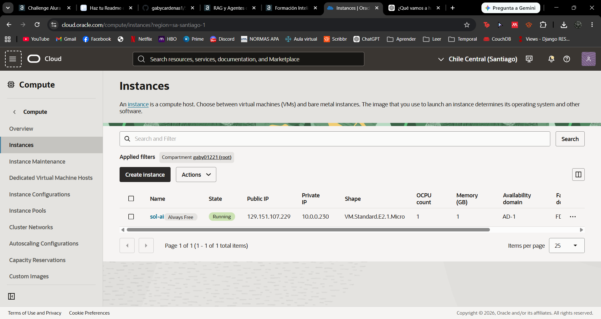
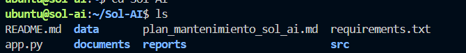
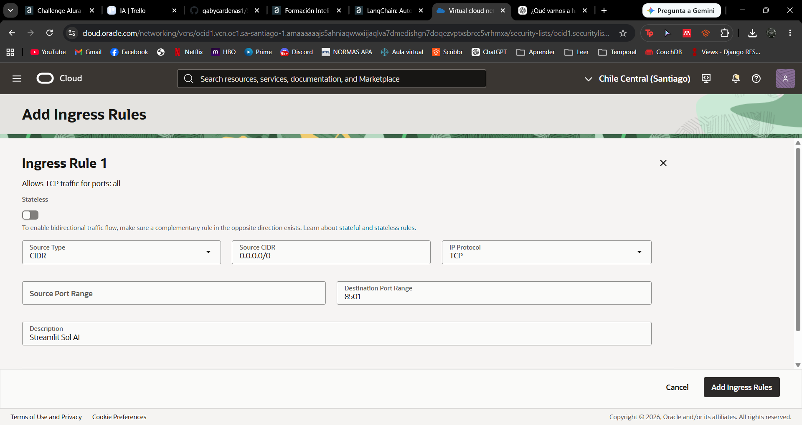
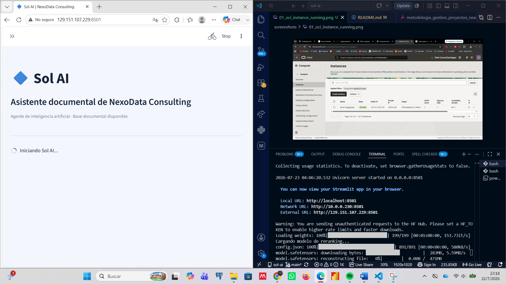
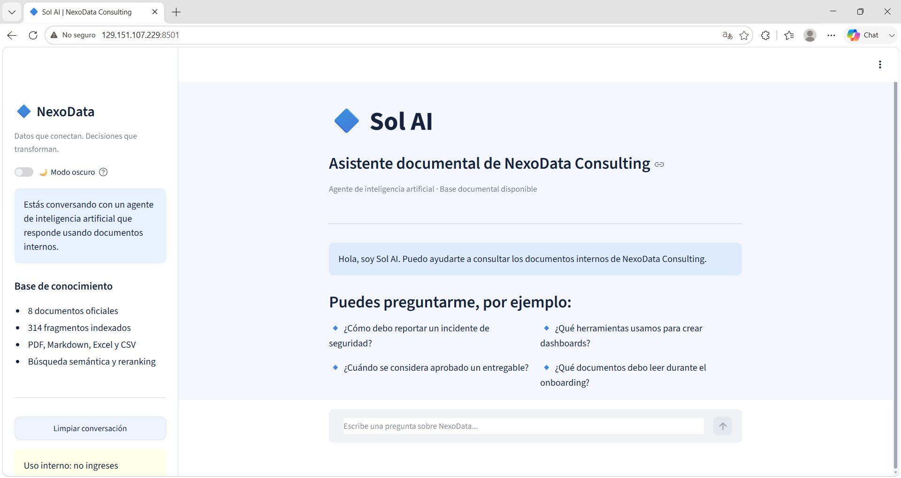
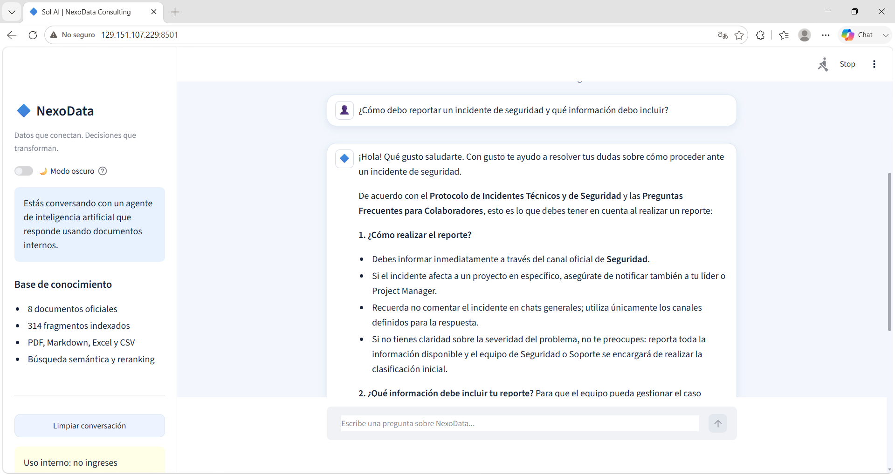
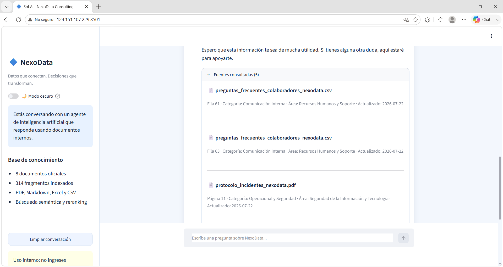
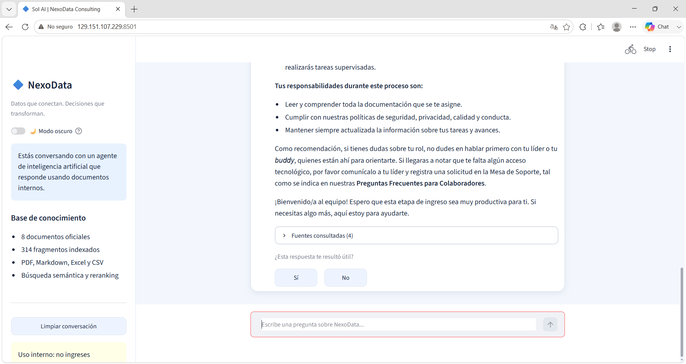
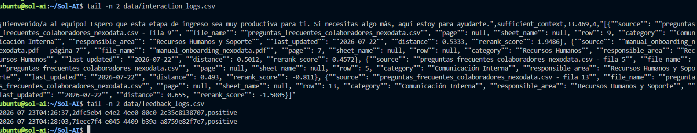

# Sol AI — Asistente Documental con RAG

Sol AI es un agente de inteligencia artificial desarrollado para **NexoData Consulting**. Permite que los colaboradores consulten documentos internos mediante lenguaje natural y reciban respuestas acompañadas de las fuentes utilizadas.

> **Datos que conectan. Decisiones que transforman.**

## 1. Descripción

La información interna de una empresa puede estar distribuida entre manuales, políticas, hojas de cálculo y preguntas frecuentes. Sol AI reduce el tiempo de búsqueda mediante una arquitectura **RAG (Retrieval-Augmented Generation)** que recupera fragmentos relevantes antes de generar cada respuesta.

El agente consulta una base documental corporativa, selecciona los fragmentos más relacionados con la pregunta y utiliza ese contexto para generar una respuesta sustentada.

## 2. Objetivo

- Consultar documentos corporativos en PDF, Markdown, Excel y CSV.
- Recuperar información mediante búsqueda semántica.
- Generar respuestas sustentadas en documentos internos.
- Mostrar las fuentes utilizadas en cada respuesta.
- Conservar el historial de conversación durante la sesión.
- Registrar interacciones, tiempos de respuesta y feedback.
- Detectar cambios documentales y actualizar ChromaDB.
- Monitorear la calidad del agente.
- Desplegar la solución en Oracle Cloud Infrastructure.

## 3. Funcionalidades

- Inventario documental con control de versión, estado y responsable.
- Indexación exclusiva de documentos aprobados y vigentes.
- Limpieza y fragmentación de contenido.
- Embeddings multilingües con Hugging Face.
- ChromaDB como base vectorial.
- Filtros por metadatos.
- Recuperación semántica.
- Reranking de fragmentos.
- Respuestas generadas con Gemini.
- Control de confianza.
- Respuesta de fallback cuando el contexto es insuficiente.
- Chat web desarrollado con Streamlit.
- Historial de conversación.
- Visualización de fuentes.
- Feedback positivo y negativo.
- Logs de interacción.
- Reporte automático de monitoreo.
- Pipeline de actualización documental.
- Despliegue en OCI Compute.

## 4. Arquitectura

```text
Usuario
  ↓
Interfaz Streamlit
  ↓
Agente RAG
  ├── Recuperación semántica en ChromaDB
  ├── Filtros por metadatos
  ├── Reranking
  ├── Control de confianza
  ↓
Gemini
  ↓
Respuesta + fuentes + feedback + logs
```

### Flujo documental

```text
Documentos corporativos
  ↓
Inventario documental
  ↓
Carga y validación
  ↓
Limpieza y fragmentación
  ↓
Embeddings
  ↓
ChromaDB
```

## 5. Tecnologías

| Componente | Tecnología |
|---|---|
| Lenguaje | Python |
| Interfaz | Streamlit |
| RAG | LangChain |
| Embeddings | Hugging Face |
| Modelo de embeddings | `sentence-transformers/paraphrase-multilingual-MiniLM-L12-v2` |
| Reranker | `cross-encoder/mmarco-mMiniLMv2-L12-H384-v1` |
| Base vectorial | ChromaDB |
| LLM | Gemini |
| Procesamiento documental | PyPDF, Pandas, OpenPyXL y Markdown |
| Control de versiones | Git y GitHub |
| Nube | Oracle Cloud Infrastructure |
| Servicio OCI | OCI Compute |

## 6. Base de conocimiento

La solución utiliza ocho documentos corporativos:

1. Manual de Bienvenida y Onboarding.
2. Catálogo de Servicios Corporativos.
3. Metodología para la Gestión de Proyectos.
4. Política de Seguridad de Datos.
5. Manual de Herramientas Tecnológicas.
6. Protocolo de Gestión de Incidentes.
7. Política de Calidad de Entregables.
8. Preguntas Frecuentes para Colaboradores.

También se utiliza un inventario documental para controlar:

- identificador;
- título oficial;
- categoría;
- versión;
- estado;
- área responsable;
- nivel de acceso;
- fecha de actualización;
- vigencia;
- observaciones.

La base vectorial contiene actualmente **314 fragmentos indexados**.

## 7. Estructura del proyecto

```text
Sol-AI/
├── app.py
├── README.md
├── requirements.txt
├── .env.example
├── plan_mantenimiento_sol_ai.md
├── documents/
│   ├── manual_onboarding_nexodata.pdf
│   ├── catalogo_servicios_nexodata.md
│   ├── metodologia_gestion_proyectos_nexodata.pdf
│   ├── politica_seguridad_datos_nexodata.pdf
│   ├── manual_herramientas_tecnologicas_nexodata.xlsx
│   ├── protocolo_incidentes_nexodata.pdf
│   ├── politica_calidad_entregables_nexodata.pdf
│   └── preguntas_frecuentes_colaboradores_nexodata.csv
├── data/
│   ├── inventario_documental_nexodata.xlsx
│   ├── interaction_logs.csv
│   ├── feedback_logs.csv
│   ├── index_update_logs.csv
│   ├── document_manifest.json
│   └── monitoring_summary.json
├── reports/
│   └── monitoring_report.md
├── screenshots/
│   ├── 01_oci_instance_running.png
│   ├── 02_ssh_connection.png
│   ├── 03_github_clone.png
│   ├── 04_oci_ingress_rule_8501.png
│   ├── 05_streamlit_startup_oci.png
│   ├── 06_streamlit_cloud.png
│   ├── 07_answers.png
│   ├── 08_sources.png
│   ├── 09_feedback.png
│   └── 10_cloud_execution_log.png
├── src/
│   ├── __init__.py
│   ├── config.py
│   ├── document_loader.py
│   ├── text_processor.py
│   ├── vector_store.py
│   ├── rag_agent.py
│   ├── document_update_pipeline.py
│   └── monitoring_report.py
└── vectorstore/
```

## 8. Instalación local

### 8.1 Clonar el repositorio

```bash
git clone https://github.com/gabycardenas1/Sol-AI.git
cd Sol-AI
```

### 8.2 Crear el entorno virtual

```bash
python -m venv .venv
```

Activación en Windows con Git Bash:

```bash
source .venv/Scripts/activate
```

Activación en Windows con PowerShell:

```powershell
.venv\Scripts\Activate.ps1
```

Activación en Linux:

```bash
source .venv/bin/activate
```

### 8.3 Instalar dependencias

```bash
python -m pip install --upgrade pip
pip install -r requirements.txt
```

### 8.4 Configurar variables de entorno

Crear un archivo `.env` en la raíz del proyecto:

```text
GEMINI_API_KEY=tu_clave
```

El archivo `.env` no debe subirse a GitHub.

## 9. Ejecución local

```bash
streamlit run app.py --server.fileWatcherType none
```

La aplicación se abre normalmente en:

```text
http://localhost:8501
```

## 10. Interfaz

La interfaz contiene:

- indicación visible de que se conversa con un agente de IA;
- campo para realizar preguntas;
- historial de conversación;
- visualización de las fuentes utilizadas;
- feedback positivo y negativo;
- modo claro y oscuro;
- opción para limpiar la conversación;
- identidad visual de NexoData Consulting.

La interfaz se mantiene intencionalmente simple porque el enfoque principal del proyecto es la arquitectura RAG y no el desarrollo de un front-end avanzado.

## 11. Actualización documental

Sol AI cuenta con un pipeline que detecta cambios mediante hashes SHA-256.

El sistema identifica:

- documentos añadidos;
- documentos modificados;
- documentos eliminados;
- cambios en el inventario documental.

### Inicializar el manifiesto

```bash
python -m src.document_update_pipeline --initialize-only
```

### Detectar cambios y actualizar

```bash
python -m src.document_update_pipeline
```

### Forzar reconstrucción

```bash
python -m src.document_update_pipeline --force
```

Archivos generados:

```text
data/document_manifest.json
data/index_update_logs.csv
```

El índice vectorial se reconstruye únicamente cuando se detectan cambios o cuando se solicita una actualización forzada.

## 12. Monitoreo

Los registros de interacción se guardan en:

```text
data/interaction_logs.csv
```

El feedback se almacena en:

```text
data/feedback_logs.csv
```

Cada interacción conserva:

- timestamp;
- identificador único;
- pregunta;
- respuesta;
- estado de confianza;
- tiempo de respuesta;
- cantidad de fuentes;
- detalle de las fuentes utilizadas.

### Generar reporte

```bash
python -m src.monitoring_report
```

Resultados:

```text
reports/monitoring_report.md
data/monitoring_summary.json
```

Las métricas incluyen:

- total de preguntas;
- respuestas con contexto suficiente;
- respuestas con contexto insuficiente;
- respuestas sin fuentes;
- tiempo promedio de respuesta;
- tiempo máximo;
- promedio de fuentes;
- feedback positivo;
- feedback negativo;
- cobertura de feedback.

## 13. Mantenimiento

El plan de mantenimiento se encuentra en:

```text
plan_mantenimiento_sol_ai.md
```

Incluye:

- curaduría documental;
- revisión periódica del inventario;
- análisis de feedback negativo;
- monitoreo de calidad;
- actualización de modelos;
- actualización de dependencias;
- pruebas posteriores a cambios;
- gestión de incidentes;
- respaldos;
- control de versiones;
- ciclo de mejora continua.

## 14. Despliegue en OCI

Sol AI está desplegado en una instancia de **OCI Compute** con Ubuntu.

### URL pública

```text
http://129.151.107.229:8501
```

> La aplicación utiliza HTTP y una IP pública de OCI. La dirección podría cambiar si se utiliza una IP efímera o si la configuración de la instancia se modifica.

### Configuración

| Elemento | Configuración |
|---|---|
| Región | Chile Central — Santiago |
| Servicio | OCI Compute |
| Shape | VM.Standard.E2.1.Micro |
| OCPU | 1 |
| Memoria RAM | 1 GB |
| Swap | 8 GB |
| Sistema operativo | Ubuntu |
| Aplicación | Streamlit |
| Puerto | 8501 |
| Código | GitHub |
| Variables sensibles | `.env` en la instancia |
| Base vectorial | ChromaDB en la instancia |

### Instalación en OCI

```bash
sudo apt update
sudo apt install -y git python3-pip python3-venv build-essential libgomp1
```

Clonación del repositorio:

```bash
git clone https://github.com/gabycardenas1/Sol-AI.git
cd Sol-AI
```

Creación del entorno virtual:

```bash
python3 -m venv .venv
source .venv/bin/activate
```

Instalación de dependencias:

```bash
python -m pip install --upgrade pip
pip install -r requirements.txt
```

### Configuración de la clave de Gemini

```bash
nano .env
```

Contenido:

```text
GEMINI_API_KEY=tu_clave
```

Protección del archivo:

```bash
chmod 600 .env
```

### Configuración de swap

Debido a la memoria limitada de la instancia, se configuraron 8 GB de swap:

```bash
sudo fallocate -l 8G /swapfile
sudo chmod 600 /swapfile
sudo mkswap /swapfile
sudo swapon /swapfile
echo '/swapfile none swap sw 0 0' | sudo tee -a /etc/fstab
```

Verificación:

```bash
free -h
swapon --show
```

### Construcción de la base vectorial

```bash
python -c "from src.vector_store import build_vector_store, get_vector_count; store = build_vector_store(); print('Vectores almacenados:', get_vector_count(store))"
```

Resultado:

```text
Vectores almacenados: 314
```

### Ejecución de Streamlit

```bash
streamlit run app.py \
  --server.address=0.0.0.0 \
  --server.port=8501 \
  --server.fileWatcherType=none
```

### Configuración de red

Se habilitó el puerto TCP `8501` mediante:

- una regla de ingreso en la Security List de OCI;
- una ruta `0.0.0.0/0` hacia el Internet Gateway;
- una regla de firewall en Ubuntu;
- una regla de `iptables`.

Comandos utilizados:

```bash
sudo ufw allow 22/tcp
sudo ufw allow 8501/tcp
sudo ufw enable
```

Regla adicional de `iptables`:

```bash
sudo iptables -I INPUT 1 -p tcp --dport 8501 -j ACCEPT
```

Para conservar las reglas después de reiniciar:

```bash
sudo apt install -y iptables-persistent
sudo netfilter-persistent save
```

### Estado de ejecución

La aplicación fue ejecutada correctamente en OCI Compute y quedó accesible desde internet mediante la IP pública y el puerto `8501`.

Actualmente Streamlit se inicia manualmente desde una sesión SSH. Para un entorno productivo se recomienda utilizar `systemd`, `tmux`, `screen` o un servicio equivalente para mantener la aplicación activa después de cerrar la terminal.

## 15. Evidencias de ejecución

### 1. Instancia OCI en ejecución



### 2. Conexión SSH


### 3. Repositorio clonado en OCI



### 4. Regla de ingreso para el puerto 8501



### 5. Inicio de Streamlit en OCI



### 6. Aplicación disponible en la nube



### 7. Respuesta generada por Sol AI



### 8. Fuentes consultadas



### 9. Feedback del usuario



### 10. Registro de ejecución en la nube



Las evidencias demuestran:

- creación de la instancia;
- acceso mediante SSH;
- clonación del repositorio;
- configuración de red;
- ejecución de Streamlit;
- acceso público;
- generación de respuestas;
- visualización de fuentes;
- registro de feedback;
- creación de logs dentro de OCI.

## 16. Seguridad

- Las claves SSH no se guardan en el repositorio.
- La clave de Gemini se almacena en `.env`.
- El archivo `.env` tiene permisos restringidos.
- Solo se indexan documentos aprobados y vigentes.
- La interfaz advierte que no deben ingresarse credenciales.
- Las fuentes permiten verificar las respuestas.
- El fallback evita responder sin contexto suficiente.
- El puerto SSH se mantiene habilitado para la administración de la instancia.

Para una versión productiva se recomienda:

- usar OCI Vault;
- implementar HTTPS;
- configurar autenticación;
- centralizar logs con OCI Logging;
- restringir el tráfico de red;
- utilizar una IP reservada o un dominio.

## 17. Pruebas realizadas

- Carga de ocho documentos.
- Validación del inventario documental.
- Limpieza de contenido.
- Generación de 314 fragmentos.
- Persistencia en ChromaDB.
- Recuperación semántica.
- Filtros por metadatos.
- Reranking.
- Respuesta con contexto suficiente.
- Respuesta con múltiples fuentes.
- Fallback por contexto insuficiente.
- Registro de feedback positivo.
- Generación de logs.
- Generación del reporte de monitoreo.
- Detección de documentos modificados.
- Reconstrucción del índice.
- Interfaz local.
- Creación de la instancia OCI.
- Conexión mediante SSH.
- Clonación del repositorio.
- Configuración de swap.
- Construcción de ChromaDB en OCI.
- Apertura del puerto 8501.
- Acceso público desde el navegador.
- Respuesta del agente en la nube.
- Visualización de fuentes.
- Registro de feedback en OCI.
- Registro de interacciones en OCI.

## 18. Limitaciones

- El sistema depende de la disponibilidad de Gemini.
- La calidad de las respuestas depende de los documentos disponibles.
- ChromaDB se ejecuta localmente dentro de la instancia.
- No existe escalamiento automático.
- No hay balanceador de carga.
- Los logs se almacenan en archivos CSV.
- El historial se conserva únicamente durante la sesión.
- La muestra inicial de monitoreo todavía es pequeña.
- La instancia tiene 1 GB de RAM y requiere swap.
- La ejecución actual de Streamlit es manual.
- La URL pública utiliza HTTP.
- No existe un certificado TLS.
- La IP pública puede cambiar si es efímera.

Estas limitaciones son aceptables para una prueba de concepto.

## 19. Mejoras futuras

- Almacenar documentos en OCI Object Storage.
- Gestionar secretos con OCI Vault.
- Centralizar logs con OCI Logging.
- Implementar GitHub Actions para CI/CD.
- Agregar autenticación corporativa.
- Persistir conversaciones por usuario.
- Crear un dashboard de observabilidad.
- Contenerizar la aplicación.
- Publicar la imagen en OCIR.
- Evaluar Oracle Autonomous Database con búsqueda vectorial.
- Configurar HTTPS.
- Utilizar un dominio.
- Crear un servicio `systemd`.
- Utilizar una instancia con mayor memoria.
- Incorporar pruebas automáticas.

## 20. Estado del proyecto

| Componente | Estado |
|---|---|
| Base documental | Completado |
| Inventario y metadatos | Completado |
| Procesamiento | Completado |
| Base vectorial | Completado |
| Recuperación semántica | Completado |
| Reranking | Completado |
| Generación con Gemini | Completado |
| Control de confianza | Completado |
| Fallback | Completado |
| Interfaz | Completado |
| Feedback | Completado |
| Logs | Completado |
| Monitoreo | Completado |
| Pipeline documental | Completado |
| Plan de mantenimiento | Completado |
| OCI Compute | Completado |
| Acceso web público | Completado |
| Evidencias finales | Completado |
| Ejecución automática permanente | Mejora futura |

## 21. Autora

**Gabriela Cárdenas**

Proyecto desarrollado como parte del Challenge de Inteligencia Artificial y Agentes RAG de Alura.

## 22. Uso

Proyecto educativo y demostrativo.

Los documentos de NexoData Consulting pertenecen a un escenario ficticio creado exclusivamente con fines académicos.